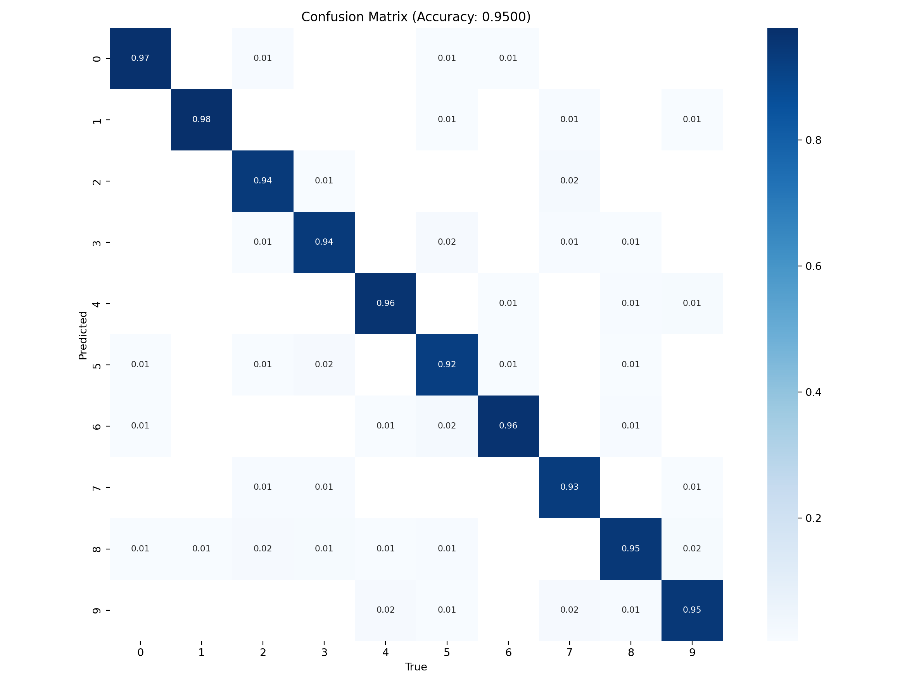

# LeNet-5 Numpy Implementation


## 核心工作
* 精读LeNet-5原始论文，独立推导卷积、池化、全连接层的前向、反向传播公式。
* 仅使用Numpy从零实现，手动编码，无调用任何深度学习库封装层。

## 项目目的
用于深入理解卷积神经网络底层运算逻辑，纯原理验证项目，不做工程化 / 性能优化。

## 用法
1. 安装依赖（推荐使用uv）：
   ```bash
   pip install -r requirements.txt
   ```
2. 训练模型：
   ```shell
   python model.py
   ```
   - 将MNIST的ubyte格式数据集`train-images-idx3-ubyte`、`train-labels-idx1-ubyte`、`t10k-images-idx3-ubyte`、`t10k-labels-idx1-ubyte`放入dataset/文件夹。
   - 训练参数可在`train_params.json`中配置。
   - 训练过程中会自动在`train/`目录下保存模型。
   - 支持断点续训。

3. 启动演示界面：
   ```shell
   python app.py
   ```
   - 默认加载`full_trained/lenet5_best_epoch37_acc9500.pkl`进行手写数字识别演示。

4. 计算模型指标：
   ```shell
   python metrics.py --model /path/to/model --test_data_path ./dataset
   ```

## 指标（lenet5_best_epoch37_acc9500.pkl）
$$
\text{Accuracy} = \frac{\sum_{i=0}^{9}\text{TP}_{i}}{\text{Total Samples}} = 95.00 \%
$$
$$
\text{Recall}_{i} = \frac{\text{TP}_{i}}{\text{TP}_{i}+\text{FN}_{i}}
$$
$$
\text{Macro Recall} = \frac{1}{10} \sum_{i=0}^{9} \text{Recall}_{i} \approx 94.95 \%
$$
  
混淆矩阵：


## 其他说明
- 当前只支持ubyte格式的MNIST数据集
- 未引入批归一化，仅支持batch size=1，因此训练速度慢
- 在i5-12600kf平均上18it/s，55分钟一个epoch
- 训练和测试图片会自动padding到32x32。
- 遗漏了平均池化层的可训练参数，导致收敛较慢
- 基于matplotlib的ui因为subplot太多所以很卡
- 为了方便直接用pickle序列化了整个对象，而不是仅保存权重对象
