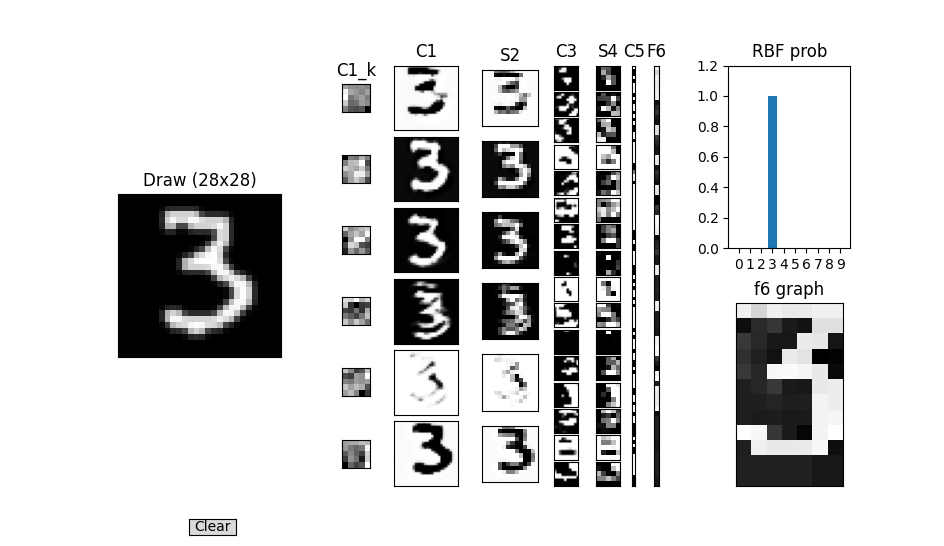

# LeNet5 Numpy Implementation



## 项目简介
本项目是对LeNet5模型的Numpy实现，旨在帮助用户理解卷积神经网络的基本原理和结构。

## 项目结构
- `app.py`: 用于演示模型的用户界面。
- `model.py`: 包含模型的定义和训练逻辑。启动训练时，请运行此文件。
- `train_params.json`: 包含训练参数的配置文件。
- `image_feeder.py`: 用于读取图像和标签数据。
- `RBF_BITMAP.py`: 包含与RBF相关的功能。
- `test.ipynb`: 用于测试和验证模型的Jupyter Notebook。
- `requirement.txt`: 项目所需的Python库列表。
- `dataset/`: 存放ubyte格式的MNIST数据集文件（如`train-images-idx3-ubyte`等）。
- `train/`: 存放训练过程中保存的模型文件。
- `full_trained/`: 存放完整训练好的模型。

## 数据集准备
请将MNIST的ubyte格式数据集文件（如`train-images-idx3-ubyte`、`train-labels-idx1-ubyte`、`t10k-images-idx3-ubyte`、`t10k-labels-idx1-ubyte`）放入`dataset/`文件夹。

## 使用说明
1. 安装依赖：
   ```bash
   pip install -r requirement.txt
   ```
2. 训练模型：
   ```bash
   python model.py
   ```
   - 训练参数可在`train_params.json`中配置。
   - 训练过程中会自动在`train/`目录下保存模型。
   - 如果训练被强制中断，重启后会自动检测`train/`目录下的模型文件并继续训练，无需手动恢复。
3. 启动演示界面：
   ```bash
   python app.py
   ```
   - 默认加载`full_trained/`下的模型进行手写数字识别演示。

## 训练参数配置
- `train_params.json`文件用于配置训练轮数、学习率、最大训练/测试样本数、模型保存路径等。

## 其他说明
- 训练和测试图片会自动padding到32x32。
- 支持断点续训，便于长时间训练。
- 当前仅支持batch size=1，因此训练速度较慢。
- full_trained/下的权重为全量训练20个epoch得到。
- 推荐先用小规模数据跑通流程，再全量训练。

如有问题欢迎提issue或交流。